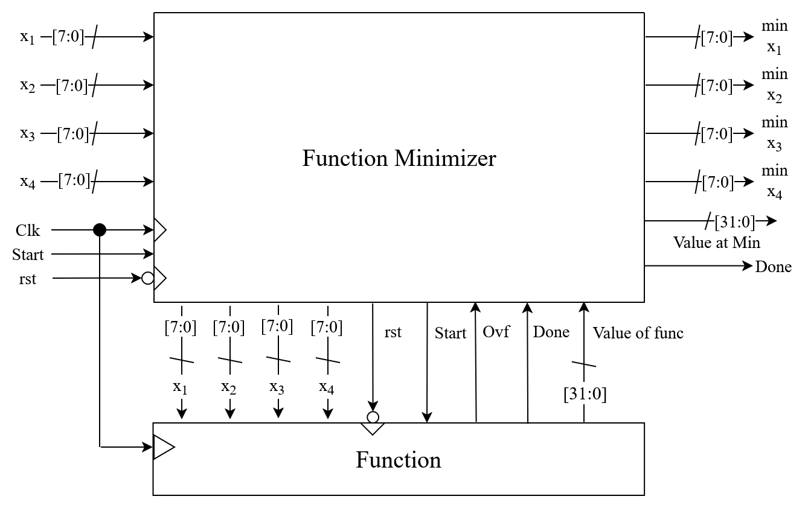
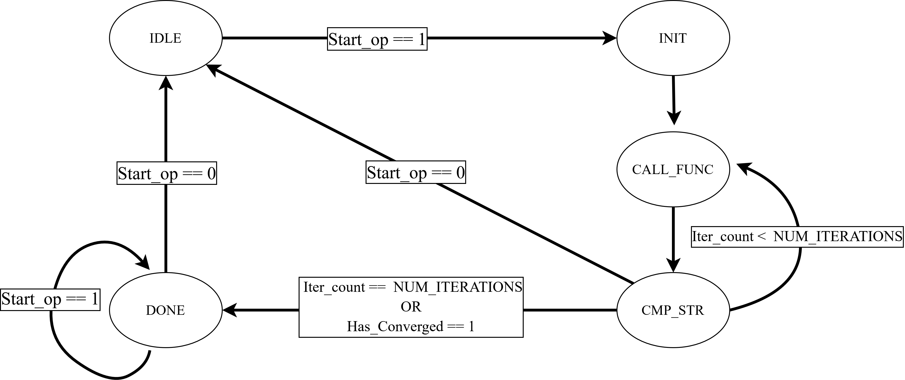
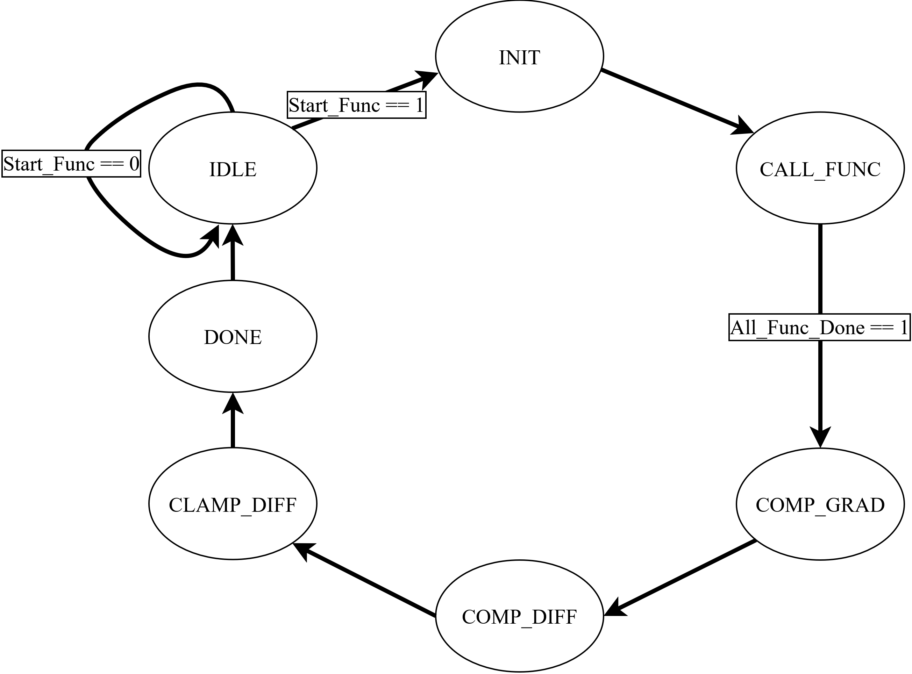
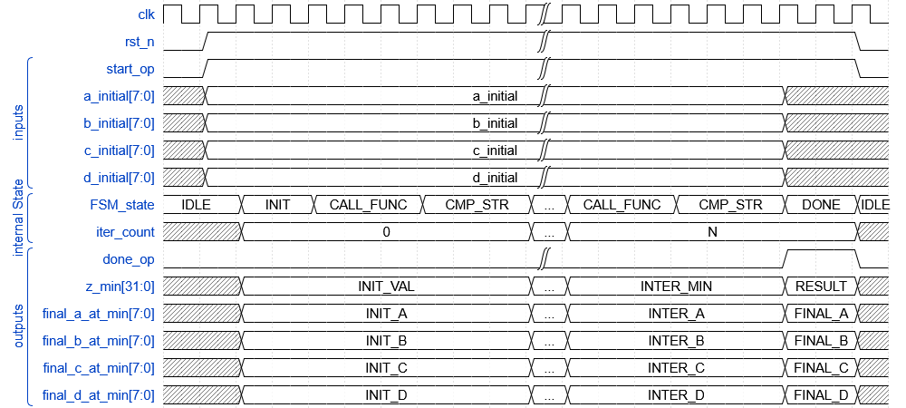

# Gradient Descent Based Function Optimizer Implemented on FPGA

**Author:** Hiriash Kumar  
**Date:** June 2025

---
## Table of Contents
- [Introduction](#introduction)
- [How to Run Simulation](#how-to-run-simulation)
- [System Architecture](#system-architecture)
  - [Hardware-Specific Optimizations](#hardware-specific-optimizations)
- [Module Architecture](#module-architecture)
  - [Top Module Interface](#top-module-interface)
    - [Learning Rates (Q24.8 Fixed-Point Format)](#learning-rates)
    - [Convergence Bounds](#convergence-bounds)
  - [Signal Descriptions](#signal-descriptions)
    - [Input Signals](#input-signals)
    - [Output Signals](#output-signals)
  - [State Machine](#state-machine)
- [Usage Example: Testbench Deep](#usage-example-testbench-deep)
  - [Testbench Configuration](#testbench-configuration)
  - [Simulation Flow](#simulation-flow)
- [Modular Function Interface (`func.v`)](#modular-function-interface)
  - [Standard Function Interface](#standard-function-interface)
  - [Interface Requirements](#interface-requirements)
    - [Mandatory Signals](#mandatory-signals)
    - [Behavioral Requirements](#behavioral-requirements)
- [Sub-Modules](#sub-modules)
  - [Operation Flow](#operation-flow)
- [Debugging and Monitoring Features](#debugging-and-monitoring-features)
  - [Real-time Monitoring](#real-time-monitoring)
  - [Operation Control](#operation-control)
- [Timing Analysis](#timing-analysis)
- [Applications](#applications)
- [Conclusion](#conclusion)

---

## Introduction

This repository contains a hardware-accelerated Gradient Descent algorithm implementation for FPGA platforms. The design provides a implementation for function minimization with hardware-specific optimizations. The main controller, implemented in the `Top` Verilog module, runs the gradient descent process through various sub-modules to achieve efficient function optimization.


### How to Run Simulation

To simulate the Gradient Descent optimizer using Icarus Verilog and view the waveforms with GTKWave, follow these steps:

1.  **Compile the Verilog files**: Open a terminal or command prompt in the directory containing the Verilog source files. Execute the following command:

    ```bash
    iverilog -g2012 -o Top_tb.out fixed_16_capped_diff.v snap_to_closest_int.v fixed_32_check_conv.v fixed_32_add_sub.v fixed_32_capped_mult.v fixed_32_comp.v fixed_32_mult.v fixed_64_mult.v func.v func_grad_val_diff.v fixed_64_clamp.v Top.v Top_tb.v
    ```

    This command compiles all necessary modules, including the `Top_tb.v` testbench, and generates an executable simulation file named `Top_tb.out`.

2.  **Run the simulation**: Execute the compiled output file using `vvp`:

    ```bash
    vvp Top_tb.out
    ```

    This command runs the simulation defined in `Top_tb.v`. During the simulation, it will generate a waveform dump file named `Top_tb.vcd`, which captures the signal activity. It will also print simulation output to the console as defined in the testbench.

3.  **View waveforms (Optional)**: To visually inspect the simulation results and signal timings, open the generated VCD file with GTKWave:

    ```bash
    gtkwave Top_tb.vcd -a Top_tb.gtkw
    ```

    This command launches GTKWave and loads the `Top_tb.vcd` waveform file. The `-a Top_tb.gtkw` option attempts to load a saved GTKWave configuration file (if it exists), which can automatically display relevant signals, simplifying analysis. If `Top_tb.gtkw` does not exist, GTKWave will open with an empty waveform view, and you can manually select signals to display.

## System Architecture

The system implements a complete hardware-accelerated gradient descent solution with the following key components:

- **Top Module**: Central FSM controller managing the optimization process
- **Function Evaluation**: Computes function values and gradients
- **Convergence Detection**: Monitors algorithm stability and termination
- **Fixed-Point Arithmetic**: Optimized for hardware implementation


*Figure 1: Function Minimizer Block Diagram*


#### Hardware-Specific Optimizations

- **Fixed-Point Representation**: Uses Q24.8 format for function values and Q8.8 for parameters
- **Overflow Protection**: Capped difference calculations prevent arithmetic overflow
- **Configurable Parameters**: Runtime tunable learning rates and convergence bounds
- **Modular Design**: Separate modules for different arithmetic operations

## Module Architecture

### Top Module Interface


#### Learning Rates

Learning rates control the step size of the gradient descent algorithm. They are specified in Q24.8 format:

```verilog
// Common learning rate values in Q24.8 format
parameter signed LEARNING_RATE_A = = 32'h00000010; // Learning Rate of 0.125 (Q24.8)
parameter signed LEARNING_RATE_B = = 32'h00000010; // Learning Rate of 0.125 (Q24.8)
parameter signed LEARNING_RATE_C = = 32'h00000010; // Learning Rate of 0.125 (Q24.8)
parameter signed LEARNING_RATE_D = = 32'h00000001; // Learning Rate of 0.125 (Q24.8)
```

#### Convergence Bounds

Convergence bounds determine when the algorithm should terminate based on function value changes:

```verilog

parameter signed LOWER_CONV_BOUND = 32'hFFFF_FFF0;  // -0.0625
parameter signed UPPER_CONV_BOUND = 32'h0000_0010;  // +0.0625
```

### Signal Descriptions

#### Input Signals

| Signal | Width | Type | Description |
|--------|-------|------|-------------|
| `clk` | 1 | input | System clock (typically 100MHz) |
| `rst_n` | 1 | input | Active-low reset signal (edge-triggered)|
| `start_op` | 1 | input | Start optimization (level-triggered) |
| `a_initial` | 8 | input signed | Initial value for parameter A (signed integer) |
| `b_initial` | 8 | input signed | Initial value for parameter B (signed integer) |
| `c_initial` | 8 | input signed | Initial value for parameter C (signed integer) |
| `d_initial` | 8 | input signed | Initial value for parameter D (signed integer) |

#### Output Signals

| Signal | Width | Type | Description |
|--------|-------|------|-------------|
| `z_min` | 32 | output signed | Minimum function value (Q24.8 format) |
| `final_a_at_min` | 8 | output signed | Optimal parameter A (signed integer) |
| `final_b_at_min` | 8 | output signed | Optimal parameter B (signed integer) |
| `final_c_at_min` | 8 | output signed | Optimal parameter C (signed integer) |
| `final_d_at_min` | 8 | output signed | Optimal parameter D (signed integer) |
| `done_op` | 1 | output | Optimization completion flag |


### State Machine

The Top module operates with the following states:

1. **IDLE**: Awaits start signal
2. **INIT**: Loads initial parameters and initializes minimum tracking
3. **CALL_FUNC**: Triggers function evaluation and gradient calculation
4. **CMP_STR**: Compares results, updates minimum, and prepares next iteration
5. **DONE**: Signals completion and outputs final results


*Figure 2: Top Level State Diagram*


-----

## Usage Example: Testbench Deep 
This Verilog `Top_tb` testbench is built to thoroughly validate the `Top` module, the FPGA-accelerated Gradient Descent optimizer.


```verilog
// Instantiate the optimizer
Top #(
    .NUM_ITERATIONS(50),
    .LEARNING_RATE_A(32'h0100),     // 1.0 in Q24.8
    .LEARNING_RATE_B(32'h0080),     // 0.5 in Q24.8
    .LEARNING_RATE_C(32'h0040),     // 0.25 in Q24.8
    .LEARNING_RATE_D(32'h0020)      // 0.125 in Q24.8
) Top (
    .clk(clk),                      // System clock
    .rst_n(rst_n),                  // Active-low reset
    .start_op(start_optimization),  // Start optimization trigger
    .a_initial(a_input),            // Initial A parameter (signed integer)
    .b_initial(b_input),            // Initial B parameter (signed integer)
    .c_initial(c_input),            // Initial C parameter (signed integer)
    .d_initial(d_input),            // Initial D parameter (signed integer)
    .z_min(minimum_value),          // Output: Minimum function value (Q24.8)
    .final_a_at_min(final_a),       // Output: Optimal A at min (signed integer)
    .final_b_at_min(final_b),       // Output: Optimal B at min (signed integer)
    .final_c_at_min(final_c),       // Output: Optimal C at min (signed integer)
    .final_d_at_min(final_d),       // Output: Optimal D at min (signed integer)
    .done_op(optimization_complete) // Output: Optimization completion flag
);
```

### Testbench Configuration

The `Top_tb` defines crucial **parameters** that dictate the optimizer's behavior:

  * **`NUM_ITERATIONS` (50)**: The maximum number of optimization steps. This acts as a hard limit for simulation and prevents indefinite runs in real hardware.
  * **`LEARNING_RATE_A` to `LEARNING_RATE_D`**: These are specified in **Q24.8 fixed-point format**. 
  * **`LOWER_CONV_BOUND` (`32'hFFFF_FFC0`) & `UPPER_CONV_BOUND` (`32'h0000_0040`)**: These define the **convergence window**. If the change in the function's output falls within this range (approximately $-0.0625$ to $0.00390625$ in Q24.8), the optimizer considers itself converged.
  * **`INCREMENT` (`8'h01`)**: Used to systematically vary initial parameters across test cases.

### Simulation Flow

The testbench orchestrates the simulation through a series of timed events:

1.  **Clock Generation**: A continuous 100 MHz clock (`clk`) is generated for synchronous operations.
2.  **Initial Setup**:
      * A **reset** (`rst_n = 1'b0`) is asserted to initialize the `Top` module.
      * All `start_op` and initial parameter inputs are set to `0`.
      * Waveform dumping (`$dumpfile`, `$dumpvars`) .
3.  **Iterative Testing**: A `for` loop runs **50 test cases**:
      * **Input Staging**: The `a_input` through `d_input` values (which are incremented each loop) are buffered and applied to the `Top` module's initial parameter inputs.
      * **Optimization Trigger**: `start_op` is asserted to begin an optimization cycle.
      * **Wait for Completion**: The testbench then **`wait(done_op == 1'b1)`**, pausing simulation until the `Top` module signals the current optimization run is complete.
      * **Result Reporting**: Upon `done_op` going high, key outputs are displayed:
          * Initial input parameters.
          * **`z_min`**: The final minimum function value found (converted from Q24.8 to decimal).
          * **`a_min_out` to `d_min_out`**: The corresponding optimal parameters at `z_min`.
          * Internal debug signals like `uut.iter_count` and `uut.converged` .
      * **Reset for Next Run**: `start_op` is de-asserted, and a brief reset (`rst_n = 1'b0`) is applied, followed by `wait(done_op == 1'b0)` to ensure the module resets its `done_op` flag before the next iteration.
      * **Parameter Increment**: `a_input` through `d_input` are incremented by `INCREMENT`, setting up a new initial condition for the subsequent test case.
4.  **Simulation End**: After all iterations, `$finish` terminates the simulation.

## Python Reference Model

A Python script validates the hardware-accelerated Gradient Descent implementation by defining the objective function, gradient, and convergence-checking algorithm.

### Objective Function
Minimizes: `(a - 2)² + b² + (c + 2)² + (2d)² - 5`
- Theoretical minimum: `a=2, b=0, c=-2, d=0` with value `-5`

```python
def objective_function(params):
    a, b, c, d = params
    return (a - 2)**2 + b**2 + (c + 2)**2 + (2*d)**2 - 5
```

### Gradient Function
Returns partial derivatives as NumPy array:

```python
def gradient(params):
    a, b, c, d = params
    return np.array([2*(a-2), 2*b, 2*(c+2), 8*d])
```

### Gradient Descent Algorithm
The `gradient_descent_output_convergence` function performs iterative optimization with convergence checking based on objective function value changes:

```python
def gradient_descent_output_convergence(objective_func, gradient_func, initial_params, learning_rate, num_iterations, convergence_threshold=0.001):
    params = np.array(initial_params, dtype=float)
    history = [objective_func(params)]
    
    for i in range(num_iterations):
        grad = gradient_func(params)
        params = params - learning_rate * grad
        current_value = objective_func(params)
        
        if i > 0 and np.abs(current_value - history[-1]) < convergence_threshold:
            print(f"*** CONVERGED at iteration {i + 1} ***")
            break
            
        history.append(current_value)
    
    return params, history
```

### Execution Parameters
- Initial parameters: `[0.0, 0.0, 0.0, 0.0]`
- Learning rate: `0.125`
- Max iterations: `50`
- Convergence threshold: `0.001`

The script outputs iteration progress and final results for comparison with FPGA implementation.

## Modular Function Interface

The `func.v` module is designed with a standardized interface that allows for easy swapping of different objective functions without modifying the core gradient descent algorithm. 
### Standard Function Interface

Any function module that replaces `func.v` must implement the following interface:

```verilog
module func(
    input clk,
    input rst_n,                    // Reset Signal Active Low
    input start_func,               // Level detected Strat signal
    input signed [15:0] a_in,       // Q8.8 format
    input signed [15:0] b_in,       // Q8.8 format
    input signed [15:0] c_in,       // Q8.8 format
    input signed [15:0] d_in,       // Q8.8 format
    output reg signed [31:0] z_out, // Q24.8 format
    output reg func_done,           // Level Done output signal
    output reg overflow             // Aritjmatic overflow
);
```

### Interface Requirements

#### Mandatory Signals

1. **Clock (`clk`)**: Synchronizes all operations within the function module
2. **Reset (`rst`)**: Initializes the function module state (active low)
3. **Input Parameters**: Four signed 16-bit parameters in Q8.8 fixed-point format
4. **Function Output (`z`)**: 32-bit signed result in Q24.8 fixed-point format
5. **Start input (`start_func`)**: signal indicating start of func
5. **Done output (`func_done`)**: signal indicating completion of func
6. **Overflow Flag**: Indicates arithmetic overflow during computation

#### Behavioral Requirements

- **Clocked Operation**: All computations must be synchronous to the clock edge
- **Completion Signal**: Function evaluation should hold the `fucn_done` signal high for atleast one clock cycle
- **Overflow Detection**: Must assert overflow flag when arithmetic operations exceed representable range

## Sub-Modules

The design utilizes several specialized sub-modules for mathematical operations and data handling within the Gradient Descent algorithm.

**`func_grad_val_diff`**: This module is central to the optimization process. It calculates the function's output (`z_val`) for the current parameter values and determines the **gradients** for each parameter. Using these gradients and predefined learning rates, it computes the necessary changes (`a_diff_out`, `b_diff_out`, `c_diff_out`, `d_diff_out`) for the parameters in the next iteration. Its internal state machine orchestrates these multi-cycle computations.

*Figure 3: func_grad_val_diff State Diagram*

### Operation Flow

1. **Initialization**: Convert 8-bit integer inputs to Q8.8 fixed-point format
2. **Function Evaluation**: Compute function value and gradients for current parameters
3. **Comparison**: Check if current result is better than stored minimum
4. **Update**: Calculate new parameter values using gradients and learning rates
5. **Convergence Check**: Determine if algorithm has converged or reached iteration limit
6. **Iteration**: Repeat from step 2 or complete if termination criteria met

**`fixed_32_comp`**: This module performs a simple **comparison** between two 32-bit fixed-point numbers (**Q24.8** format), outputting '1' if the first is less than the second. This is used to check if the new function value is an improvement over the current minimum.

**`fixed_32_check_conv`**: This module is dedicated to **convergence detection**. By calculating the difference between successive function values, it determines if the algorithm has converged within a specified bound, signaling when to terminate the optimization.

**`fixed_16_capped_diff`**: This module handles **parameter updates** by calculating the difference between two 16-bit fixed-point numbers **(Q8.8 format)**. It includes crucial overflow and underflow protection, clamping the output to prevent arithmetic errors. it tells the module how far and in what direction the current point of evaluation should move.

**`snap_to_closest_int`**: This module converts a 16-bit fixed-point number **(Q8.8)** into an 8-bit signed integer by **rounding to the nearest whole number**, incorporating overflow protection during the conversion for **Q8.8** numbers greater than **127.0** .

**`fixed_64_mult`**: This module performs **multiplication of two 32-bit fixed-point numbers** **(Q24.8)**, generating a 64-bit fixed-point product while maintaining proper scaling.

**`fixed_64_clamp`**: This module **limits a 64-bit fixed-point input** to the valid range of a 16-bit Q8.8 fixed-point number, signaling and capping the value if it exceeds these bounds.

**`fixed_32_mult`**: This module performs **multiplication of two 32-bit fixed-point numbers** **(Q24.8)**, producing a 32-bit **(56.8)** fixed-point result. It also detects and signals overflow or underflow for this operation.

**`fixed_32_add_sub`**: This module performs **addition or subtraction** of two 32-bit fixed-point numbers **(Q24.8)**, controlled by an input signal, and indicates any overflow that occurs.


## Debugging and Monitoring Features

### Real-time Monitoring
- **Continuous Minimum Tracking**: Outputs reflect current best minimum even during operation
- **Divergence Detection**: Monitor output values to detect algorithmic divergence
- **Configurable Parameters**: Adjust learning rates and other parameters without redesign

### Operation Control
- **Pause/Resume**: Use `start_op` to halt operation without losing state
- **Parameter Observation**: Monitor intermediate results throughout optimization
- **Convergence Monitoring**: Track algorithm stability and termination conditions


## Timing Analysis

The following timing diagram illustrates the operation flow and state transitions of the gradient descent optimizer:


*Figure 4: Function Minimizer Timing Diagram*

The timing diagram shows:
- **IDLE** state waiting for `start_op` signal
- **INIT** state loading initial parameters and setting `z_min` to a high value
- **CALL_FUNC** state triggering function evaluation (multi-cycle operation)
- **CMP_STR** state comparing results, updating minimum, and preparing next iteration
- **DONE** state asserting completion signal with final results

The iterative process continues until either the maximum number of iterations is reached or convergence is detected.

## Applications

This FPGA-based gradient descent optimizer is suitable for:
- Real-time optimization in embedded systems
- Signal processing applications requiring parameter tuning
- Machine learning inference acceleration
- Control system parameter optimization
- Any application requiring fast, hardware-accelerated function minimization

## Conclusion

This hardware-accelerated Gradient Descent implementation provides a robust, efficient, and configurable solution for function optimization on FPGA platforms. The design addresses key algorithmic limitations while leveraging hardware-specific optimizations for optimal performance. The modular architecture and comprehensive debugging features make it suitable for a wide range of optimization applications requiring real-time performance and reliability.